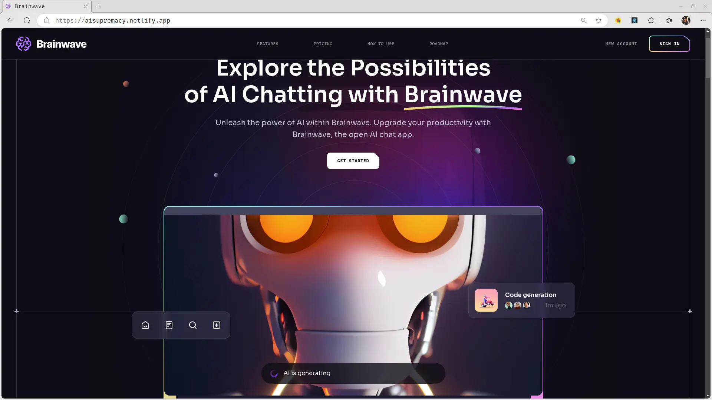
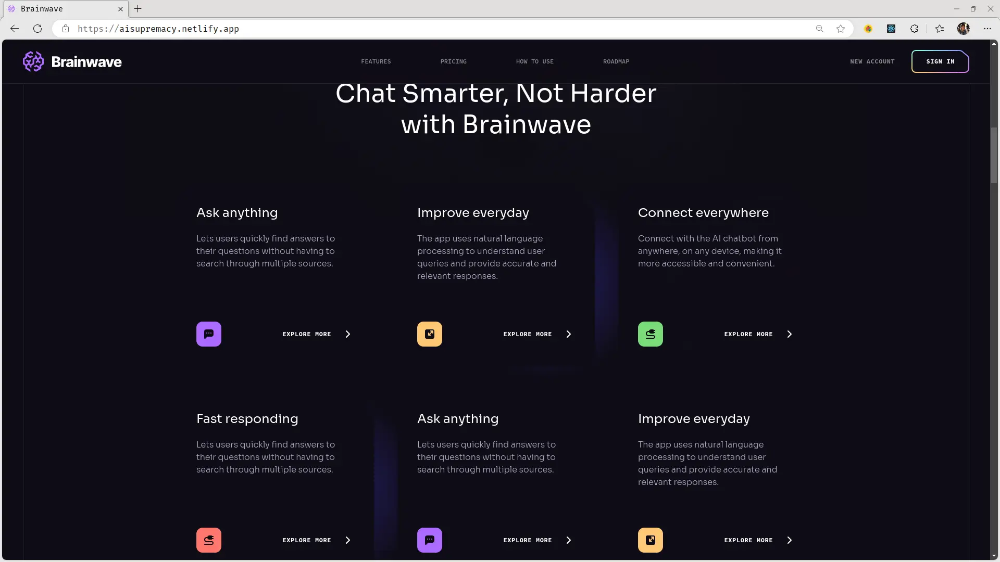
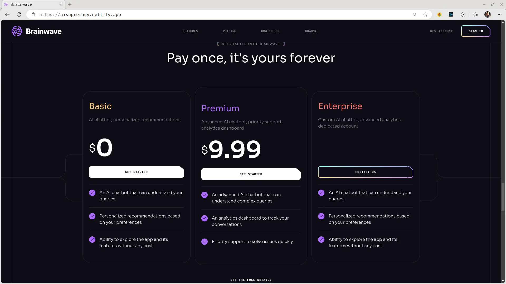

# Brainwave Typescript

A modern UI landing page created with React-TS and TailwindCSS. This is a
Typescript implementation of the brainwave website from team ui8. It also
handles user authentication via google-oauth.

_See site live demo
@[aisupremacy.netlify.app](https://aisupremacy.netlify.app/)_

 

